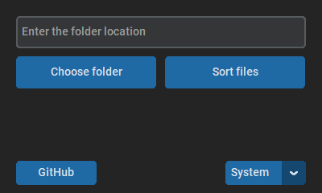

<div align="center">
    <h1>
    Welcome to my Python-File-Sorter DEV mini project!
    </h1>
</div>

<h1 align="center">
    <a></a>
</h1>

<h1 align="center">
    <a>  </a>
</h1>

## TODO DEV:
Change the behaviour of the software. First check for certain files and then create folders (so that empty folders are not created)
## How it works
The script creates a Sorted folder in which other folders (Documents, photos and similar) are created. Then it moves the files to these folders.

## How to use
---
> To start __main.py__ needs [Python](https://www.python.org/) installed on your system

> Also install [CustomTkinter](https://github.com/TomSchimansky/CustomTkinter):  
```
pip3 install customtkinter
```
---
1. Launch main.py
2. Click on the ```Choose folder``` button or paste the path to the folder in the box above
3. Click on the ```Sort files``` button