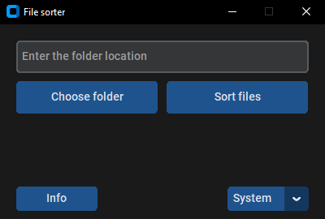

<div align="center">
    <h1>
    Welcome to my Python-File-Sorter mini project!
    </h1>
</div>

<h1 align="center">
    <a></a>
</h1>

<h1 align="center">
    <a>  </a>
</h1>

## NOTE:
This program is in beta version and I am not responsible if something bad happens

## How it works
You select the folder where you want to sort the files. A "Sorted" folder is created in this folder, and folders are created in it by file type (Photos, videos, etc.) Then the files are moved to them. (I wonder if anyone will understand this explanation?)

## How to use
---
> Python and Git must be installed on your system

1. Install [CustomTkinter](https://github.com/TomSchimansky/CustomTkinter):  
```
pip3 install customtkinter
```
2. Clone this repository:
```
git clone https://github.com/nikallow/Python-File-Sorter.git
```
3. Launch __main.py__
4. Click on the ```Choose folder``` button or paste the path to the folder in the box above
5. Click on the ```Sort files``` button